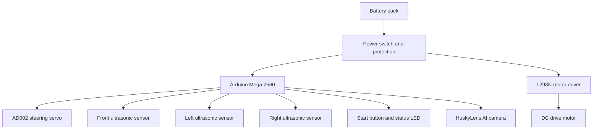

# 1. Project Overview

SKRobotics is building an autonomous model vehicle for the WRO 2026 Future Engineers category. The vehicle must drive around a closed track, complete three laps, handle the Open Challenge reliably, and later solve the Obstacle Challenge with red and green traffic signs and parking.

The first engineering goal is reliability. A slow robot that completes laps gives the team better development feedback than a fast robot that fails randomly. Once the baseline is repeatable, speed and corner aggressiveness can be improved.

## Current Prototype

The current prototype is based on an Arduino Mega 2560, three ultrasonic sensors, an AD002 steering servo, a DC motor, an L298N motor driver, a 3 x 3.7 V battery holder, and a planned HuskyLens AI camera for Obstacle Challenge color recognition.

## Development Strategy

The project is split into four stages:

1. Build a safe electrical baseline with the L298N motor driver.
2. Tune ultrasonic wall following and continuous corner prefire for the Open Challenge.
3. Add orientation or distance feedback for better repeatability.
4. Integrate HuskyLens color recognition for Obstacle Challenge decisions.

## High-Level System Diagram

## Main Performance Hypothesis

Our Open Challenge hypothesis is that the robot can complete laps faster if it starts steering before the front wall is too close. This "prefire" turning approach avoids a full stop-and-turn sequence. The risk is that turning too early causes the robot to cut into the inner wall or miss the next lane. The tuning process will compare different front distance thresholds, steering angles, and turn hold times.

## Current Limitations

- L298N wiring and PWM behavior still need to be documented with test data.
- No IMU or encoder yet, so turn angle and lap distance are estimated.
- HuskyLens obstacle recognition is selected but not yet calibrated.
- Parking strategy is not selected yet.
- No final CAD or mechanical measurements yet.

These limitations are tracked intentionally. The repository should show the engineering process, not hide missing parts.

