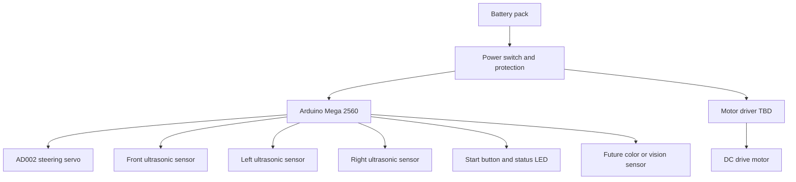

# 1. Project Overview

SKRobotics is building an autonomous model vehicle for the WRO 2026 Future Engineers category. The vehicle must drive around a closed track, complete three laps, handle the Open Challenge reliably, and later solve the Obstacle Challenge with red and green traffic signs and parking.

The first engineering goal is reliability. A slow robot that completes laps gives the team better development feedback than a fast robot that fails randomly. Once the baseline is repeatable, speed and corner aggressiveness can be improved.

## Current Prototype

The current prototype is based on an Arduino Mega 2560, three ultrasonic sensors, an AD002 steering servo, a DC motor, and a 3 x 3.7 V battery holder. The L298N motor driver was removed, so propulsion control is documented as a missing subsystem until a safer and more efficient driver is selected.

## Development Strategy

The project is split into four stages:

1. Build a safe electrical baseline with a correct motor driver.
2. Tune ultrasonic wall following and continuous corner prefire for the Open Challenge.
3. Add orientation or distance feedback for better repeatability.
4. Add color or vision sensing for Obstacle Challenge decisions.

## High-Level System Diagram

## Main Performance Hypothesis

Our Open Challenge hypothesis is that the robot can complete laps faster if it starts steering before the front wall is too close. This "prefire" turning approach avoids a full stop-and-turn sequence. The risk is that turning too early causes the robot to cut into the inner wall or miss the next lane. The tuning process will compare different front distance thresholds, steering angles, and turn hold times.

## Current Limitations

- No selected motor driver after removing L298N.
- No IMU or encoder yet, so turn angle and lap distance are estimated.
- No color/vision sensor yet, so Obstacle Challenge color decisions are not solved.
- No final CAD or vehicle photos yet.

These limitations are tracked intentionally. The repository should show the engineering process, not hide missing parts.

