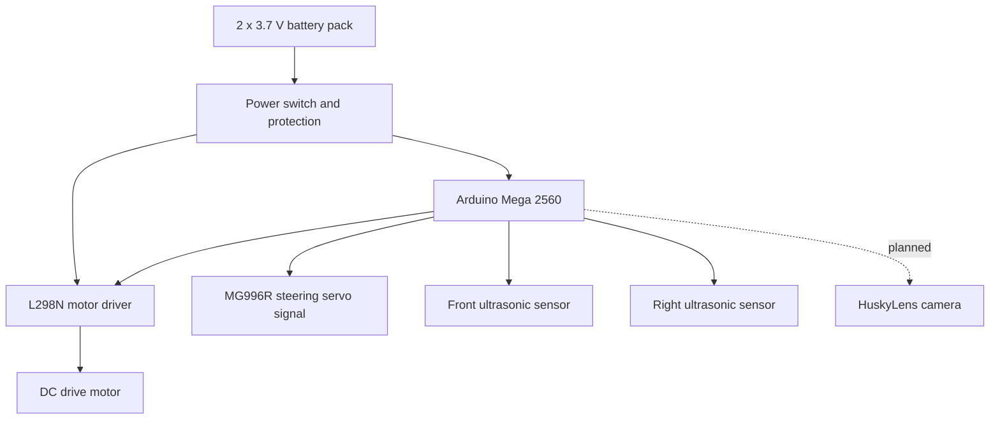

# 1. Project Overview

SKRobotics is building an autonomous model vehicle for the WRO 2026 Future Engineers category. The vehicle must drive around a closed track, complete three laps, handle the Open Challenge reliably, and later solve the Obstacle Challenge with red and green traffic signs and parking.

The first engineering goal is reliability. A slow robot that completes laps gives the team better development feedback than a fast robot that fails randomly. Once the baseline is repeatable, speed and corner aggressiveness can be improved.

## Current Prototype

The current prototype is based on an Arduino Mega 2560, two HC-SR04 ultrasonic sensors, an MG996R steering servo, an L298N motor driver, a DC motor, a breadboard, and two 3.7 V cells wired for 7.4 V nominal. HuskyLens is selected as the planned camera for Obstacle Challenge red/green recognition, but it is not integrated into the active code yet.

The current code does not use a left ultrasonic sensor, gyroscope, encoder, start button, or status LED.

## Development Strategy

The project is split into four stages:

1. Verify safe wiring with the Arduino Mega, L298N, servo, ultrasonic sensors, and battery pack.
2. Tune right-wall following and continuous left/right turns for the Open Challenge.
3. Add lap counting and automatic stop after the movement baseline is reliable.
4. Integrate and test HuskyLens for Obstacle Challenge decisions.

## High-Level System Diagram

## Main Performance Hypothesis

Our Open Challenge hypothesis is that the robot can complete laps faster if it keeps moving through corners instead of stopping. The current code uses front and right ultrasonic distance readings to choose between right turns, left turns, and right-wall following. The risk is that timed turns can vary with battery voltage, floor grip, motor behavior, and steering geometry.

## Current Limitations

- Only front and right ultrasonic sensors are installed.
- Left-wall recovery is limited because there is no left ultrasonic sensor.
- No gyroscope or encoder is used, so turn angle and distance are not directly measured.
- No start button is used; the current code begins after startup warmup.
- The current code does not yet count laps or stop automatically after three laps.
- HuskyLens obstacle recognition is selected but not integrated or calibrated yet.
- Parking strategy is not selected yet.
- No final CAD or mechanical measurements yet.

These limitations are tracked intentionally. The repository should show the engineering process, not hide missing parts.
