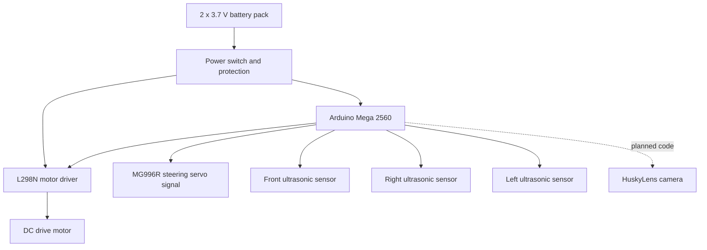

# 1. Project Overview

SKRobotics is building an autonomous model vehicle for the WRO 2026 Future Engineers category. The vehicle must drive around a closed track, complete three laps, handle the Open Challenge reliably, and later solve the Obstacle Challenge with red and green traffic signs and parking.

The first engineering goal is reliability. A slow robot that completes laps gives the team better development feedback than a fast robot that fails randomly. Once the baseline is repeatable, speed and corner aggressiveness can be improved.

## Current Prototype

The current prototype is based on an Arduino Mega 2560, three HC-SR04 ultrasonic sensors, an MG996R steering servo, an L298N motor driver, a DC motor, a breadboard, and two 3.7 V cells wired for 7.4 V nominal. HuskyLens is installed and ready for Obstacle Challenge perception tests, but it is not integrated into the Arduino code yet.

The current code does not use a gyroscope, encoder, start button, status LED, or color sensor code.

## Development Strategy

The project is split into four stages:

1. Verify safe wiring with the Arduino Mega, L298N, servo, ultrasonic sensors, and battery pack.
2. Tune side-opening detection and continuous left/right turns for the Open Challenge.
3. Validate 12-corner counting, final advance, and automatic stop behavior.
4. Integrate and test HuskyLens for Obstacle Challenge and parking decisions.

## High-Level System Diagram

## Main Performance Hypothesis

Our Open Challenge hypothesis is that the robot can complete laps faster if it keeps moving through corners instead of stopping. The current code uses left and right ultrasonic side openings to choose turn direction, while the front ultrasonic sensor supports safety, turn exit, and corner counting. The risk is that timed turns can vary with battery voltage, floor grip, motor behavior, and steering geometry.

## Current Limitations

- Three ultrasonic sensors are installed: front, right, and left.
- No gyroscope or encoder is used, so turn angle and distance are not directly measured.
- No start button is used; the current code starts moving immediately after power-on.
- The current code counts 12 corners, advances on the final straight, and stops automatically.
- HuskyLens is installed and manually tested, but Arduino communication and red/green code are not implemented yet.
- Parking strategy is selected conceptually, but not implemented in code yet.
- No final CAD or mechanical measurements yet.

These limitations are tracked intentionally. The repository should show the engineering process, not hide missing parts.
