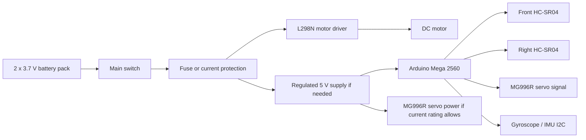

# 4. Power and Sensors

## Power Architecture

The current battery pack uses two 3.7 V cells for 7.4 V nominal. The fully charged voltage can be higher than nominal, so the L298N, motor, Arduino input path, and servo supply must be checked before full-speed testing.

Planned power distribution:

The L298N is selected because it is available and easy to integrate with Arduino Mega PWM and direction outputs. This choice must be tested carefully because the L298N can waste voltage as heat. The MG996R servo may draw more current than the Arduino 5 V regulator can safely provide, so a separate regulated servo supply may be required. All grounds must be common.

Because the Arduino Mega uses 5 V logic, the HC-SR04 echo signals do not require the ESP32 level-converter protection that was needed in the previous prototype attempt.

## Current Sensor Set

| Sensor | Position | Use |
| --- | --- | --- |
| Front ultrasonic | Front, facing forward | Detect upcoming wall for prefire turns |
| Right ultrasonic | Right side, facing right | Measure distance to right wall |
| Gyroscope / IMU | Mounted on chassis | Estimate yaw during turns |

## Draft Pin Map

| Component | Arduino Mega Pin | Notes |
| --- | --- | --- |
| MG996R steering servo signal | D6 | Servo signal |
| L298N ENA | D5 | Motor speed PWM |
| L298N IN1 | D4 | Motor direction |
| L298N IN2 | D3 | Motor direction |
| Front HC-SR04 TRIG | D22 | Ultrasonic trigger |
| Front HC-SR04 ECHO | D23 | Ultrasonic echo |
| Right HC-SR04 TRIG | D24 | Ultrasonic trigger |
| Right HC-SR04 ECHO | D25 | Ultrasonic echo |
| Gyroscope SDA | D20 / SDA | Arduino Mega I2C data |
| Gyroscope SCL | D21 / SCL | Arduino Mega I2C clock |
| Start button | D30 | Uses internal pull-up |

## Sensor Placement Reasoning

The front ultrasonic sensor supports early corner detection. The right ultrasonic sensor supports right-wall following during straight sections and post-turn recovery. The gyroscope gives an additional signal for turn completion, which is important because the robot no longer has a left ultrasonic sensor.

- Ultrasonic readings can fail on angled or soft surfaces.
- With only one side sensor, the robot has less information about lane position.
- Gyroscope yaw can drift, so it should be calibrated at startup and checked during testing.
- At high speed, sensor latency and steering inertia become important.

## Calibration Plan

1. Measure each ultrasonic sensor at fixed distances.
2. Record raw readings in `data/calibration/ultrasonic_distance_samples.csv`.
3. Compare average error and outlier frequency.
4. Tune valid distance limits and filtering.
5. Repeat after final sensor mounting, because angle and height affect readings.
6. Rotate the robot manually by 90 degrees and compare gyroscope yaw output.

## Missing Obstacle Sensor

The current component list does not include a camera or color sensor. Before the Obstacle Challenge can be solved, the team must choose how the robot will identify red and green traffic signs.
