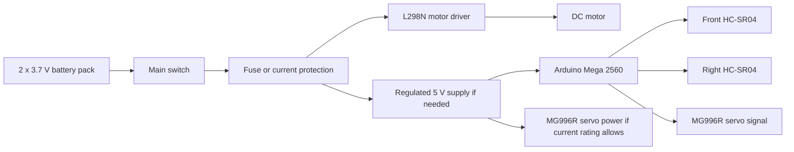

# 4. Power and Sensors

## Power Architecture

The current battery pack uses two 3.7 V cells for 7.4 V nominal. The fully charged voltage can be higher than nominal, so the L298N, motor, Arduino input path, and servo supply must be checked before full-speed testing.

Planned power distribution:

The L298N is selected because it is available and easy to integrate with Arduino Mega PWM and direction outputs. This choice must be tested carefully because the L298N can waste voltage as heat. The MG996R servo may draw more current than the Arduino 5 V regulator can safely provide, so a separate regulated servo supply may be required. All grounds must be common.

Because the Arduino Mega uses 5 V logic, the HC-SR04 echo signals are compatible with the controller's digital inputs.

## Current Sensor Set

| Sensor | Position | Use |
| --- | --- | --- |
| Front ultrasonic | Front, facing forward | Detect upcoming walls and turn timing |
| Right ultrasonic | Right side, facing right | Detect right-side openings and support right-wall following |

No left ultrasonic sensor, gyroscope, encoder, start button, or status LED is used in the current code.

## Current Pin Map

This pin map comes from the final Arduino Mega code currently stored in `src/SKRobotics_OpenChallenge/SKRobotics_OpenChallenge.ino`.

The current wiring diagram image is stored at `schemes/electrical_wiring_diagram.svg`.

| Component | Arduino Mega Pin | Notes |
| --- | --- | --- |
| MG996R steering servo signal | D9 | Servo signal |
| L298N ENA | D5 | Motor speed PWM |
| L298N IN1 | D6 | Motor direction |
| L298N IN2 | D7 | Motor direction |
| Front HC-SR04 TRIG | D22 | Ultrasonic trigger |
| Front HC-SR04 ECHO | D23 | Ultrasonic echo |
| Right HC-SR04 TRIG | D24 | Ultrasonic trigger |
| Right HC-SR04 ECHO | D25 | Ultrasonic echo |

## Sensor Placement Reasoning

The front ultrasonic sensor supports early wall detection. The right ultrasonic sensor supports right-wall following and detects open space on the right side. This is a minimal sensor set, so the software must avoid overreacting to a single noisy reading.

- Ultrasonic readings can fail on angled or soft surfaces.
- With only one side sensor, the robot has less information about lane position.
- Without a gyroscope or encoder, turns depend on time and ultrasonic exit conditions.
- At high speed, sensor latency and steering inertia become important.

## Calibration Plan

1. Measure each ultrasonic sensor at fixed distances.
2. Record raw readings in `data/calibration/ultrasonic_distance_samples.csv`.
3. Compare average error and outlier frequency.
4. Tune valid distance limits and filtering.
5. Repeat after final sensor mounting, because angle and height affect readings.
6. Test `FRONT_TURN_CM`, `RIGHT_FREE_CM`, `RIGHT_TARGET_CM`, and turn timing on the real track.

## Obstacle Sensor

HuskyLens is selected as the planned camera for red/green traffic sign detection. It still needs mounting, power verification, Arduino Mega communication testing, and detection calibration before it can be treated as working Obstacle Challenge hardware.
