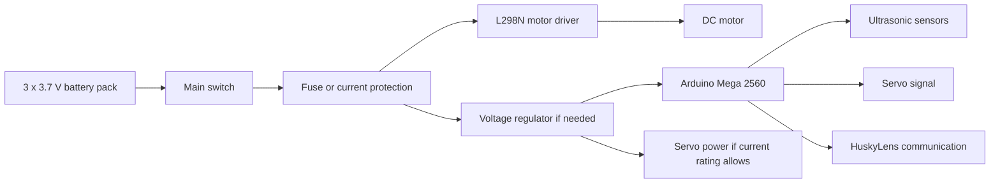

# 4. Power and Sensors

## Power Architecture

The current battery holder uses three 3.7 V cells. A fully charged 3-cell lithium pack can be significantly above 11.1 V, so every component must be checked against actual pack voltage.

Planned power distribution:

The L298N is selected for the first motor-control prototype because it is available and easy to integrate with Arduino. This choice must be tested carefully because the L298N can waste voltage as heat. The servo should not be powered from an overloaded Arduino 5 V pin if it draws high current. A separate regulated 5 V supply may be required, with common ground shared between Arduino, L298N, servo, camera, and sensors.

## Current Sensor Set

| Sensor | Position | Use |
| --- | --- | --- |
| Front ultrasonic | Front, facing forward | Detect upcoming wall for prefire turns |
| Left ultrasonic | Left side, facing left | Measure distance to left wall |
| Right ultrasonic | Right side, facing right | Measure distance to right wall |
| HuskyLens AI camera | Planned front-facing camera mount | Detect red and green obstacle blocks |

## Draft Pin Map

| Component | Arduino Mega Pin | Notes |
| --- | --- | --- |
| Steering servo signal | D6 | AD002 servo signal |
| L298N motor input A | D5 | Draft motor PWM/direction pin |
| L298N motor input B | D4 | Draft motor PWM/direction pin |
| Front ultrasonic trigger | D22 | Draft wiring |
| Front ultrasonic echo | D23 | Draft wiring |
| Left ultrasonic trigger | D24 | Draft wiring |
| Left ultrasonic echo | D25 | Draft wiring |
| Right ultrasonic trigger | D26 | Draft wiring |
| Right ultrasonic echo | D27 | Draft wiring |
| HuskyLens communication | TBD | I2C or UART will be selected after testing |
| Start button | A0 | Uses internal pull-up |
| Status LED | D13 | Built-in LED is convenient |

## Sensor Placement Reasoning

The front ultrasonic sensor supports early corner detection. The side ultrasonic sensors support lane centering and post-turn recovery. The HuskyLens is planned for red/green traffic-sign recognition during the Obstacle Challenge. This combination separates distance control from color classification, which makes the software easier to test in stages.

- Ultrasonic sensors cannot identify red and green obstacle colors.
- Ultrasonic readings can fail on angled or soft surfaces.
- Side distance alone does not measure yaw.
- HuskyLens recognition must be tested under the same lighting and block colors used during practice.
- At high speed, sensor latency and steering inertia become important.

## Calibration Plan

1. Measure each ultrasonic sensor at fixed distances.
2. Record raw readings in `data/calibration/ultrasonic_distance_samples.csv`.
3. Compare average error and outlier frequency.
4. Tune valid distance limits and filtering.
5. Repeat after final sensor mounting, because angle and height affect readings.

## HuskyLens Validation Plan

1. Mount the HuskyLens so the camera sees the traffic signs before the robot reaches them.
2. Train or configure red and green block recognition.
3. Record detection results under different lighting conditions.
4. Decide whether Arduino communication will use I2C or UART.
5. Add a test sketch that prints the detected color and confidence/position data.
6. Use the test data to define when the robot commits to a red or green evasion maneuver.

