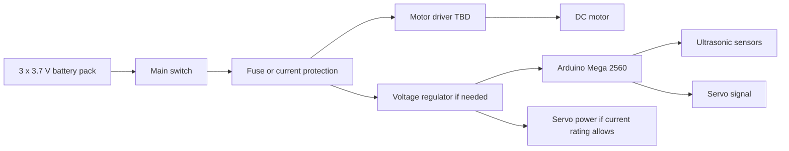

# 4. Power and Sensors

## Power Architecture

The current battery holder uses three 3.7 V cells. A fully charged 3-cell lithium pack can be significantly above 11.1 V, so every component must be checked against actual pack voltage.

Planned power distribution:

The servo should not be powered from an overloaded Arduino 5 V pin if it draws high current. A separate regulated 5 V supply may be required, with common ground shared between Arduino, driver, servo, and sensors.

## Current Sensor Set

| Sensor | Position | Use |
| --- | --- | --- |
| Front ultrasonic | Front, facing forward | Detect upcoming wall for prefire turns |
| Left ultrasonic | Left side, facing left | Measure distance to left wall |
| Right ultrasonic | Right side, facing right | Measure distance to right wall |

## Draft Pin Map

| Component | Arduino Mega Pin | Notes |
| --- | --- | --- |
| Steering servo signal | D6 | AD002 servo signal |
| Motor driver PWM | D5 | Placeholder until driver is selected |
| Motor driver direction | D4 | Placeholder until driver is selected |
| Front ultrasonic trigger | D22 | Draft wiring |
| Front ultrasonic echo | D23 | Draft wiring |
| Left ultrasonic trigger | D24 | Draft wiring |
| Left ultrasonic echo | D25 | Draft wiring |
| Right ultrasonic trigger | D26 | Draft wiring |
| Right ultrasonic echo | D27 | Draft wiring |
| Start button | A0 | Uses internal pull-up |
| Status LED | D13 | Built-in LED is convenient |

## Sensor Placement Reasoning

The front sensor supports early corner detection. The side sensors support lane centering and post-turn recovery. The three-sensor layout is simple, affordable, and compatible with Arduino Mega timing, but it has limits:

- It cannot identify red and green obstacle colors.
- Ultrasonic readings can fail on angled or soft surfaces.
- Side distance alone does not measure yaw.
- At high speed, sensor latency and steering inertia become important.

## Calibration Plan

1. Measure each ultrasonic sensor at fixed distances.
2. Record raw readings in `data/calibration/ultrasonic_distance_samples.csv`.
3. Compare average error and outlier frequency.
4. Tune valid distance limits and filtering.
5. Repeat after final sensor mounting, because angle and height affect readings.

