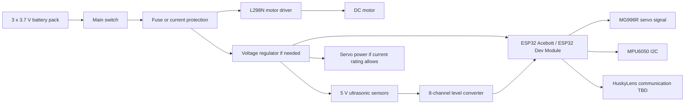

# 4. Power and Sensors

## Power Architecture

The current battery holder uses three 3.7 V cells. A fully charged 3-cell lithium pack can be significantly above 11.1 V, so every component must be checked against actual pack voltage.

Planned power distribution:

The L298N is selected for the first motor-control prototype because it is available and easy to integrate with ESP32 PWM and direction outputs. This choice must be tested carefully because the L298N can waste voltage as heat. The MG996R servo should not be powered from an overloaded ESP32 5 V pin if it draws high current. A separate regulated 5 V supply may be required, with common ground shared between the ESP32, L298N, servo, camera, IMU, and sensors.

The ESP32 is a 3.3 V logic device. The team is using an 8-channel bidirectional level conversion board for signals that connect 5 V modules to ESP32 GPIO. This is especially important for the HC-SR04 echo lines, because the echo output can be 5 V while ESP32 GPIO inputs are not 5 V tolerant.

Current component evidence: [level converter photo](../assets/hardware_photos/level_converter.png).

## Current Sensor Set

| Sensor | Position | Use |
| --- | --- | --- |
| Front ultrasonic | Front, facing forward | Detect upcoming wall for prefire turns |
| Left ultrasonic | Left side, facing left | Measure distance to left wall |
| Right ultrasonic | Right side, facing right | Measure distance to right wall |
| MPU6050 IMU | Mounted on chassis | Estimate yaw during turns |
| HuskyLens AI camera | Planned front-facing camera mount | Detect red and green obstacle blocks |

## Confirmed First Pin Map

| Component | ESP32 GPIO | Notes |
| --- | --- | --- |
| MG996R steering servo signal | GPIO 13 | 50 Hz PWM generated with ESP32 LEDC |
| L298N ENA | GPIO 14 | Motor speed PWM |
| L298N IN1 | GPIO 32 | Motor direction |
| L298N IN2 | GPIO 33 | Motor direction |
| Front HC-SR04 TRIG | GPIO 25 | Ultrasonic trigger |
| Front HC-SR04 ECHO | GPIO 34 | Input-only GPIO; route through level converter |
| Left HC-SR04 TRIG | GPIO 26 | Ultrasonic trigger |
| Left HC-SR04 ECHO | GPIO 35 | Input-only GPIO; route through level converter |
| Right HC-SR04 TRIG | GPIO 27 | Ultrasonic trigger |
| Right HC-SR04 ECHO | GPIO 36 | Input-only GPIO; route through level converter |
| MPU6050 SDA | GPIO 21 | I2C data |
| MPU6050 SCL | GPIO 22 | I2C clock |
| Start button | GPIO 23 | Uses internal pull-up |
| HuskyLens communication | TBD | Selected but not integrated yet |

## Sensor Placement Reasoning

The front ultrasonic sensor supports early corner detection. The side ultrasonic sensors support lane centering and post-turn recovery. The MPU6050 helps validate when a turn has reached the expected yaw change. The HuskyLens is planned for red/green traffic-sign recognition during the Obstacle Challenge. This combination separates distance control, orientation estimation, and color classification, which makes the software easier to test in stages.

- Ultrasonic sensors cannot identify red and green obstacle colors.
- Ultrasonic readings can fail on angled or soft surfaces.
- Side distance alone does not measure yaw, so the MPU6050 is used as an additional turn-exit signal.
- HuskyLens recognition must be tested under the same lighting and block colors used during practice.
- At high speed, sensor latency and steering inertia become important.

## Calibration Plan

1. Measure each ultrasonic sensor at fixed distances.
2. Record raw readings in `data/calibration/ultrasonic_distance_samples.csv`.
3. Compare average error and outlier frequency.
4. Tune valid distance limits and filtering.
5. Repeat after final sensor mounting, because angle and height affect readings.

## HuskyLens Validation Plan

1. Mount the HuskyLens so the camera sees the traffic signs before the robot reaches them.
2. Train or configure red and green block recognition.
3. Record detection results under different lighting conditions.
4. Decide whether ESP32 communication will use I2C or UART.
5. Add a test sketch that prints the detected color and confidence/position data.
6. Use the test data to define when the robot commits to a red or green evasion maneuver.

