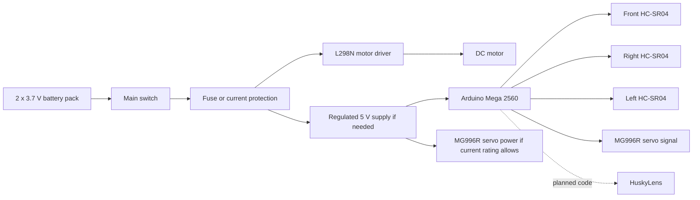

# 4. Power and Sensors

## Power Architecture

The current battery pack uses two 3.7 V cells for 7.4 V nominal. The fully charged voltage can be higher than nominal, so the L298N, motor, Arduino input path, and servo supply must be checked before full-speed testing.

Planned power distribution:

The L298N is selected because it is available and easy to integrate with Arduino Mega PWM and direction outputs. This choice must be tested carefully because the L298N can waste voltage as heat. The MG996R servo may draw more current than the Arduino 5 V regulator can safely provide, so a separate regulated servo supply may be required. All grounds must be common.

Because the Arduino Mega uses 5 V logic, the HC-SR04 echo signals are compatible with the controller's digital inputs.

## Current Sensor Set

| Sensor | Position | Use |
| --- | --- | --- |
| Front ultrasonic | Front, facing forward | Secondary corner cue and diagnostic distance reading |
| Right ultrasonic | Right side, facing right | Detect right-side openings and support lateral correction |
| Left ultrasonic | Left side, facing left | Detect left-side openings and support lateral correction |
| HuskyLens | Front vision mount | Planned red/green sign and parking-area detection |

No gyroscope, encoder, start button, status LED, or color sensor code is used in the current Open Challenge code. HuskyLens is installed and manually tested, but Arduino communication code and measured recognition data are still pending.

## Current Pin Map

This pin map comes from the final Arduino Mega code currently stored in `src/SKRobotics_OpenChallenge/SKRobotics_OpenChallenge.ino`.

The current wiring diagram image is stored at `schemes/electrical_wiring_diagram.svg`.

| Component | Arduino Mega Pin | Notes |
| --- | --- | --- |
| MG996R steering servo signal | D9 | Servo signal |
| L298N ENA | D5 | Motor speed PWM |
| L298N IN1 | D6 | Motor direction |
| L298N IN2 | D7 | Motor direction |
| Front HC-SR04 TRIG | D42 | Ultrasonic trigger |
| Front HC-SR04 ECHO | D43 | Ultrasonic echo |
| Right HC-SR04 TRIG | D46 | Ultrasonic trigger |
| Right HC-SR04 ECHO | D47 | Ultrasonic echo |
| Left HC-SR04 TRIG | D52 | Ultrasonic trigger |
| Left HC-SR04 ECHO | D53 | Ultrasonic echo |

## Sensor Placement Reasoning

The right and left ultrasonic sensors detect wall-to-opening transitions so the robot can start turns early. The front ultrasonic sensor is used as secondary corner evidence and a diagnostic reading, while the current race logic does not stop the robot from a single front reading.

- Ultrasonic readings can fail on angled or soft surfaces.
- Without a gyroscope or encoder, turns depend on time and ultrasonic exit conditions.
- At high speed, sensor latency and steering inertia become important.

## Calibration Plan

1. Measure each ultrasonic sensor at fixed distances.
2. Record raw readings in `data/calibration/ultrasonic_distance_samples.csv`.
3. Compare average error and outlier frequency.
4. Tune valid distance limits and filtering.
5. Repeat after final sensor mounting, because angle and height affect readings.
6. Test `SIDE_TURN_TRIGGER_CM`, `FRONT_COUNT_CM`, wall reacquisition thresholds, and left/right turn timing on the real track.

## Obstacle Sensor

HuskyLens is installed as the planned camera for red/green traffic sign detection and parking-area detection. The team has performed manual HuskyLens checks without Arduino code integration yet. It still needs power verification, Arduino Mega communication testing, mounting validation, and detection calibration before it can be treated as working Obstacle Challenge hardware.
