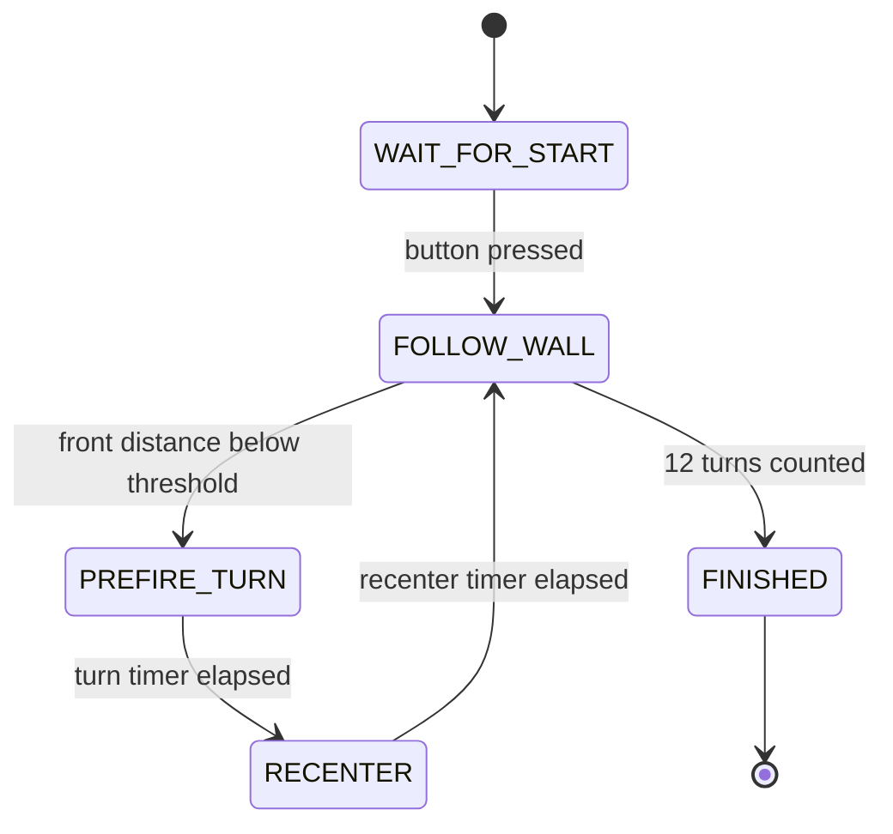

# 5. Software Architecture

## Overview

The software is written for Arduino Mega 2560 using Arduino C++. The first implementation focuses on the current hardware baseline: three ultrasonic sensors, one steering servo, a start button, a status LED, and a generic motor driver interface.

The core design is a finite state machine. This makes the robot easier to test because each behavior has a clear entry condition, exit condition, and set of tuning constants.

## Open Challenge State Machine

## Main Modules

| Module | Responsibility |
| --- | --- |
| Sensor reading | Reads front, left, and right ultrasonic sensors with filtering |
| Wall following | Converts side distance error into steering correction |
| Turn prefire | Starts corner steering before collision risk |
| Motor output | Sends PWM and direction commands to a future motor driver |
| State management | Controls transitions and turn counting |
| Debug output | Prints values for tuning through Serial Monitor |

## Important Constants

- `TARGET_SIDE_DISTANCE_CM`: target distance to the selected wall.
- `FRONT_PREFIRE_CM`: front distance that triggers a turn.
- `TURN_HOLD_MS`: time to hold aggressive steering.
- `RECENTER_MS`: time to stabilize after the corner.
- `SIDE_CORRECTION_GAIN`: steering correction per centimeter of side error.
- `TOTAL_TURNS_TARGET`: 12 turns for three laps.

## Known Edge Cases

- Front sensor returns zero because no echo was received.
- Side sensor reads the wrong surface during a corner.
- Robot starts angled relative to the wall.
- Battery voltage changes motor speed and turn radius.
- Servo mechanical limits differ from code constants.
- The selected motor driver inverts direction logic.

## Build Instructions

1. Install Arduino IDE.
2. Install the `NewPing` library.
3. Connect Arduino Mega 2560.
4. Open `src/SKRobotics_OpenChallenge/SKRobotics_OpenChallenge.ino`.
5. Verify pin constants match the wiring.
6. Keep `MOTOR_OUTPUT_ENABLED` as `false` until the motor driver is installed.
7. Compile and upload.
8. Use Serial Monitor at 115200 baud for debug values.

