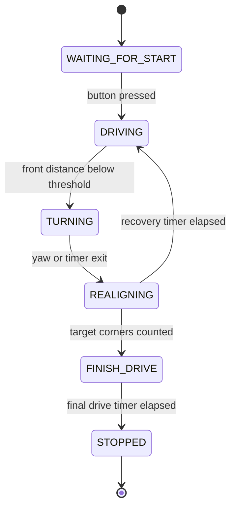

# 5. Software Architecture

## Overview

The software is written for Arduino Mega 2560 using Arduino C++. The current implementation focuses on the urgent hardware baseline: front ultrasonic sensor, right ultrasonic sensor, MG996R steering servo, gyroscope/IMU, start button, and L298N motor driver.

The core design is a finite state machine. This makes the robot easier to test because each behavior has a clear entry condition, exit condition, and set of tuning constants.

## Open Challenge State Machine

## Main Modules

| Module | Responsibility |
| --- | --- |
| Sensor reading | Reads front and right ultrasonic sensors with filtering |
| Right-wall following | Converts right distance error into steering correction |
| Turn prefire | Starts corner steering before collision risk |
| Gyroscope update | Reads yaw rate to estimate turn progress |
| Motor output | Sends PWM and direction commands to the L298N motor driver |
| State management | Controls transitions and turn counting |
| Debug output | Prints values for tuning through Serial Monitor |

## Important Constants

- `TARGET_RIGHT_DISTANCE_CM`: target distance from the right wall.
- `FRONT_TURN_CM`: front distance that triggers a prefire turn.
- `FRONT_DANGER_CM`: emergency front distance.
- `TURN_DIRECTION`: default turn direction for the current track setup.
- `TURN_EXIT_YAW_DEG`: yaw change used to validate turn exit if the gyroscope is available.
- `MIN_TURN_MS` and `MAX_TURN_MS`: turn timing limits.
- `SERVO_CENTER`, `SERVO_LEFT_LIMIT`, and `SERVO_RIGHT_LIMIT`: steering command limits.

## Known Edge Cases

- Front sensor returns zero because no echo was received.
- Right sensor reads the wrong surface during a corner.
- Robot starts angled relative to the wall.
- Battery voltage changes motor speed and turn radius.
- Servo mechanical limits differ from code constants.
- The L298N direction may be inverted.
- Gyroscope yaw can drift and must be calibrated on startup.

## Build Instructions

1. Install Arduino IDE.
2. Select `Arduino Mega or Mega 2560`.
3. Select processor `ATmega2560`.
4. Open `src/SKRobotics_OpenChallenge/SKRobotics_OpenChallenge.ino`.
5. Verify pin constants match the real wiring.
6. Keep the robot lifted during first motor and servo tests.
7. Compile and upload.
8. Use Serial Monitor at 115200 baud for debug values.
