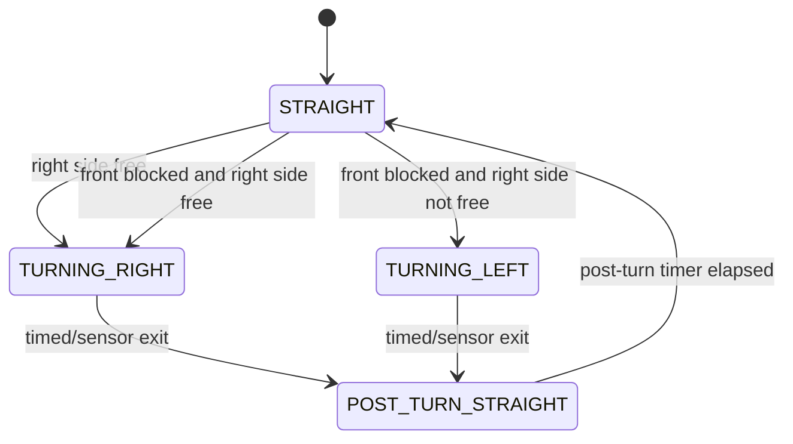

# 5. Software Architecture

## Overview

The software is written for Arduino Mega 2560 using Arduino C++. The current implementation focuses on the final two-sensor baseline: front ultrasonic sensor, right ultrasonic sensor, MG996R steering servo, and L298N motor driver.

The code does not use a start button, status LED, encoder, left ultrasonic sensor, or gyroscope.

The core design is a finite state machine. This makes the robot easier to test because each behavior has a clear entry condition, exit condition, and set of tuning constants.

## Open Challenge State Machine

## Main Modules

| Module | Responsibility |
| --- | --- |
| Sensor reading | Reads front and right ultrasonic sensors with filtering |
| Right-wall following | Applies simple steering correction from right distance |
| Turn decision | Chooses left or right turn only while in `STRAIGHT` |
| Turn hold | Holds the chosen turn until the exit condition |
| Motor output | Sends PWM and direction commands to the L298N motor driver |
| Servo output | Commands MG996R steering angle |
| Debug output | Prints values for tuning through Serial Monitor |

## Important Constants

- `RIGHT_TARGET_CM`: target distance from the right wall.
- `RIGHT_FREE_CM`: right-side distance interpreted as open space.
- `RIGHT_TOO_CLOSE_CM`: right-side distance that triggers steering away from the wall.
- `FRONT_TURN_CM`: front distance that triggers a turn decision.
- `FRONT_CLEAR_AFTER_TURN_CM`: front distance used as turn-exit evidence.
- `MIN_TURN_MS` and `MAX_TURN_MS`: turn timing limits.
- `POST_TURN_STRAIGHT_MS`: time to drive straight before allowing another decision.
- `SERVO_LEFT`, `SERVO_CENTER`, and `SERVO_RIGHT`: steering command limits.

## Known Edge Cases

- Front sensor returns maximum distance because no echo was received.
- Right sensor sees open space and triggers a right turn too early.
- Robot starts angled relative to the wall.
- Battery voltage changes motor speed and turn radius.
- Servo mechanical limits differ from code constants.
- The L298N direction may be inverted.
- The current code does not count laps or stop after three laps yet.
- `MIN_TURN_MS` is currently greater than `MAX_TURN_MS` in the final code, so the max-time exit dominates turn duration until the team retunes those constants.

## Build Instructions

1. Install Arduino IDE.
2. Select `Arduino Mega or Mega 2560`.
3. Select processor `ATmega2560`.
4. Open `src/SKRobotics_OpenChallenge/SKRobotics_OpenChallenge.ino`.
5. Verify pin constants match the real wiring.
6. Keep the robot lifted during first motor and servo tests.
7. Compile and upload.
8. Use Serial Monitor at 9600 baud for debug values.
