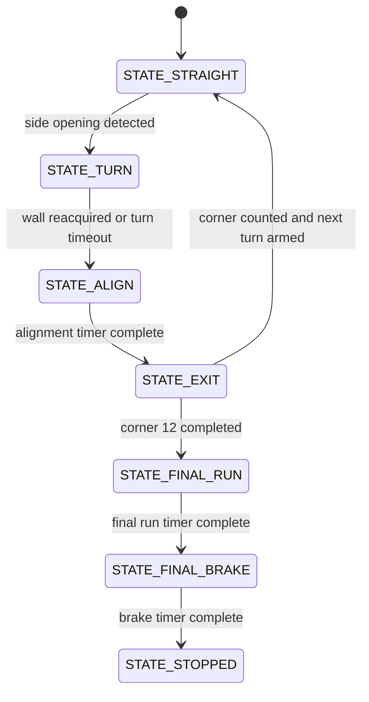

# 5. Software Architecture

## Overview

The software is written for Arduino Mega 2560 using Arduino C++. The current Open Challenge implementation uses three HC-SR04 ultrasonic sensors, an MG996R steering servo, and an L298N motor driver.

The code does not use a start button, status LED, encoder, gyroscope, or color sensor code. It starts driving immediately when powered, reads the ultrasonic sensors with timed `pulseIn()` calls in a side-prioritized sequence, counts 12 corners for three laps, runs the final straight, actively brakes, and stops.

## Open Challenge State Machine

## Main Modules

| Module | Responsibility |
| --- | --- |
| Timed sonar reader | Reads left, right, and front HC-SR04 sensors with a short `pulseIn()` timeout |
| Exponential filtering | Smooths usable ultrasonic readings for steering and decisions |
| Direction detection | Uses the first reliable side opening to choose left or right track direction |
| Side-opening turn trigger | Starts turns from wall-to-opening transitions on the lateral sensors |
| Front corner cue | Uses the front sensor as secondary corner evidence, not as a race stop trigger |
| Turn sequence | Holds a fixed calibrated steering angle, centers, exits, and rearms the next corner |
| Corner/lap counting | Counts 12 corners, equal to three laps |
| Motor output | Sends PWM and direction commands to the L298N motor driver |
| Servo output | Commands MG996R steering angles |
| Debug output | Prints state, sensor, servo, PWM, corner, and lap values through Serial Monitor |

## Important Constants

- `PIN_SERVO`: steering servo signal on D9.
- `PIN_ENA`, `PIN_IN1`, `PIN_IN2`: L298N control on D5, D6, and D7.
- `PIN_FRONT_TRIG` / `PIN_FRONT_ECHO`: front ultrasonic on D42/D43.
- `PIN_RIGHT_TRIG` / `PIN_RIGHT_ECHO`: right ultrasonic on D46/D47.
- `PIN_LEFT_TRIG` / `PIN_LEFT_ECHO`: left ultrasonic on D52/D53.
- `CORNERS_TO_FINISH`: 12 corners for three laps.
- `SIDE_TURN_TRIGGER_CM`: side distance interpreted as an opening.
- `FRONT_COUNT_CM`: front distance used as secondary corner evidence.
- `MIN_LEFT_TURN_MS` / `MAX_LEFT_TURN_MS`: left turn timing limits.
- `MIN_RIGHT_TURN_MS` / `MAX_RIGHT_TURN_MS`: right turn timing limits.
- `FINAL_RUN_MS` and `FINAL_BRAKE_MS`: final straight and active brake timing.
- `DEBUG_INTERVAL_MS`: Serial Monitor telemetry interval at 115200 baud.

## Known Edge Cases

- Ultrasonic readings can fail on angled surfaces.
- The L298N direction may need changing through `MOTOR_FORWARD_IN1` and `MOTOR_FORWARD_IN2`.
- Steering geometry may need retuning through the servo constants.
- The robot has no gyroscope or encoder, so turn quality depends on side-opening detection, wall reacquisition, and timing.
- HuskyLens obstacle and parking logic is planned but not integrated into this Open Challenge firmware.

## Build Instructions

1. Install Arduino IDE.
2. Select `Arduino Mega or Mega 2560`.
3. Select processor `ATmega2560`.
4. Open `src/SKRobotics_OpenChallenge/SKRobotics_OpenChallenge.ino`.
5. Verify pin constants match the real wiring.
6. Keep the robot lifted during first motor and servo tests.
7. Compile and upload.
8. Use Serial Monitor at 115200 baud for debug values.
