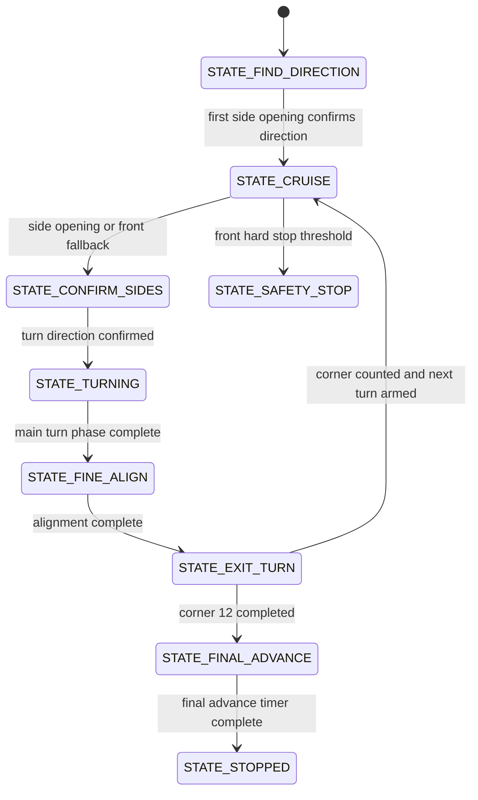

# 5. Software Architecture

## Overview

The software is written for Arduino Mega 2560 using Arduino C++. The current Open Challenge implementation uses three HC-SR04 ultrasonic sensors, an MG996R steering servo, and an L298N motor driver.

The code does not use a start button, status LED, encoder, gyroscope, or color sensor code. It starts automatically when powered, reads the ultrasonic sensors without blocking the main control loop, counts 12 corners for three laps, advances on the final straight, and stops.

## Open Challenge State Machine

## Main Modules

| Module | Responsibility |
| --- | --- |
| Non-blocking sonar scheduler | Reads right, left, and front HC-SR04 sensors in a repeated order |
| Median filtering | Reduces noisy ultrasonic readings |
| Direction detection | Uses the first reliable side opening to choose left or right track direction |
| Side-opening turn trigger | Starts turns from wall-to-opening transitions on the lateral sensors |
| Front fallback and safety | Uses the front sensor for approach, hard stop, and turn-exit evidence |
| Turn sequence | Applies turn entry, fine alignment, countersteer, and recovery phases |
| Corner/lap counting | Counts 12 corners, equal to three laps |
| Motor output | Sends PWM and direction commands to the L298N motor driver |
| Servo output | Commands MG996R steering angles |
| Debug output | Prints state, sensor, servo, PWM, corner, and lap values through Serial Monitor |

## Important Constants

- `PIN_SERVO`: steering servo signal on D9.
- `PIN_ENA`, `PIN_IN1`, `PIN_IN2`: L298N control on D5, D6, and D7.
- `PIN_FRONT_TRIG` / `PIN_FRONT_ECHO`: front ultrasonic on D42/D43.
- `PIN_RIGHT_TRIG` / `PIN_RIGHT_ECHO`: right ultrasonic on D46/D47.
- `PIN_LEFT_TRIG` / `PIN_LEFT_ECHO`: left ultrasonic on D52/D53.
- `TOTAL_TURNS`: 12 corners for three laps.
- `SIDE_OPEN_CM`: side distance interpreted as an opening.
- `FRONT_TURN_CM`: front fallback threshold for turn capture.
- `TURN_MIN_MS` and `TURN_MAX_MS`: turn timing limits.
- `FINAL_ADVANCE_MS`: forward time after corner 12 before stopping.
- `SERIAL_DEBUG`: enables Serial Monitor telemetry at 115200 baud.

## Known Edge Cases

- Ultrasonic readings can fail on angled surfaces.
- The L298N direction may be inverted and is controlled by `MOTOR_INVERTED`.
- Steering geometry may need retuning through the servo constants.
- The robot has no gyroscope or encoder, so turn quality depends on ultrasonic exit conditions and timing.
- HuskyLens obstacle and parking logic is planned but not integrated into this Open Challenge firmware.

## Build Instructions

1. Install Arduino IDE.
2. Select `Arduino Mega or Mega 2560`.
3. Select processor `ATmega2560`.
4. Open `src/SKRobotics_OpenChallenge/SKRobotics_OpenChallenge.ino`.
5. Verify pin constants match the real wiring.
6. Keep the robot lifted during first motor and servo tests.
7. Compile and upload.
8. Use Serial Monitor at 115200 baud for debug values.
