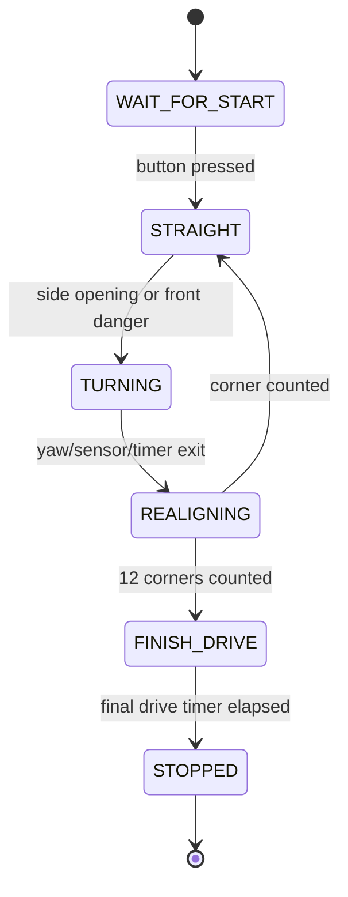

# 5. Software Architecture

## Overview

The software is written for an ESP32 Acebott / ESP32 Dev Module using Arduino C++. The first implementation focuses on the current hardware baseline: three ultrasonic sensors, one MG996R steering servo, an MPU6050 IMU, a start button, and an L298N motor driver interface.

The core design is a finite state machine. This makes the robot easier to test because each behavior has a clear entry condition, exit condition, and set of tuning constants.

## Open Challenge State Machine

## Main Modules

| Module | Responsibility |
| --- | --- |
| Sensor reading | Reads front, left, and right ultrasonic sensors with filtering |
| Opening detection | Confirms when a side wall disappears and a turn opening is available |
| Turn prefire | Starts corner steering while the robot keeps moving |
| IMU update | Reads MPU6050 yaw to help validate turn exit |
| Motor output | Sends ESP32 LEDC PWM and direction commands to the L298N motor driver |
| State management | Controls transitions and turn counting |
| Debug output | Prints values for tuning through Serial Monitor |

## Important Constants

- `FRONT_CLEAR_CM`: front distance that allows faster straight movement.
- `FRONT_DANGER_CM`: front distance that forces an emergency turn.
- `WALL_PRESENT_CM` and `WALL_LOST_CM`: side-wall thresholds for opening detection.
- `MIN_TURN_MS`, `MAX_TURN_MS`, and `TURN_SENSOR_BACKUP_MS`: turn timing limits.
- `TURN_EXIT_YAW_DEG`: yaw change used to validate turn exit when the MPU6050 is available.
- `SERVO_LEFT_ANGLE`, `SERVO_CENTER_ANGLE`, and `SERVO_RIGHT_ANGLE`: steering command convention.

## Known Edge Cases

- Front sensor returns zero because no echo was received.
- Side sensor reads the wrong surface during a corner.
- Robot starts angled relative to the wall.
- Battery voltage changes motor speed and turn radius.
- Servo mechanical limits differ from code constants.
- The selected motor driver inverts direction logic.
- MPU6050 yaw can drift and must be calibrated on startup.
- Ultrasonic echo lines must be level-shifted before entering ESP32 GPIO.

## Build Instructions

1. Install Arduino IDE.
2. Install ESP32 board support in Arduino IDE.
3. Select the correct ESP32 Acebott / ESP32 Dev Module board.
4. Open `src/SKRobotics_OpenChallenge/SKRobotics_OpenChallenge.ino`.
5. Verify pin constants match the wiring.
6. Keep the robot lifted during first motor and servo tests.
7. Compile and upload.
8. Use Serial Monitor at 115200 baud for debug values.

