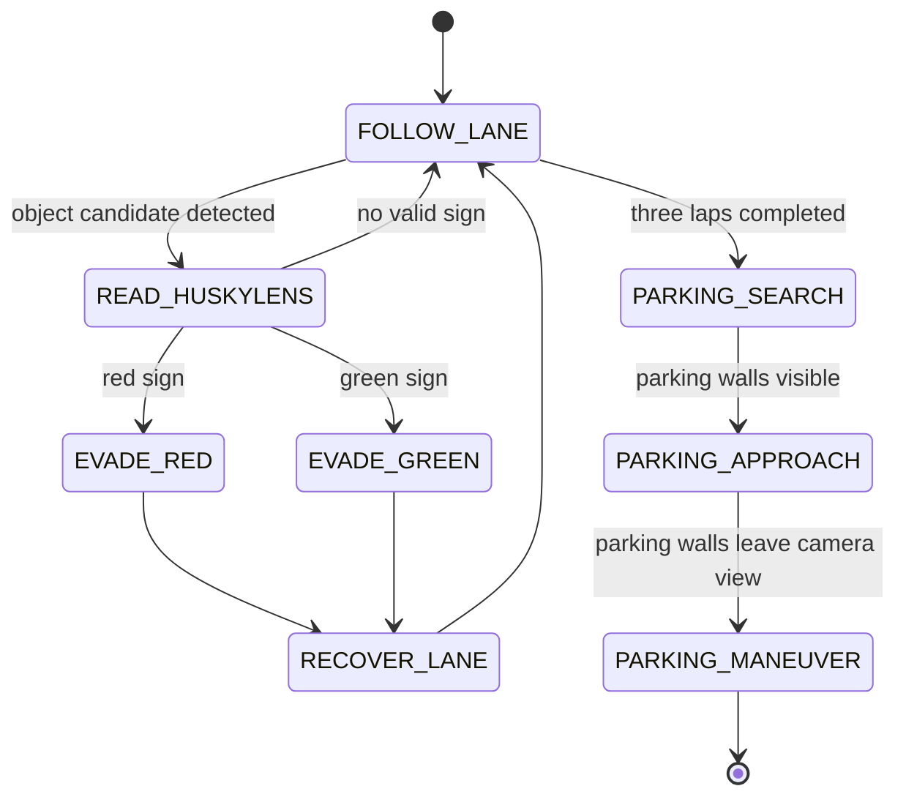

# 7. Obstacle Challenge Strategy

## Current Status

The team selected and installed a HuskyLens camera as the planned perception sensor for the Obstacle Challenge. The HuskyLens has been tested manually, but it is not integrated into the active Arduino Mega code yet, so the repository treats obstacle behavior as a planned extension rather than a completed feature.

Parking strategy is selected conceptually. The robot should use HuskyLens to detect the parking area, drive forward until the two parking walls leave the camera point of view, then reverse and align into the parking box. The motion sequence is not implemented in Arduino code yet.

## Rule-Based Requirement

The robot must pass red and green traffic signs on the correct side. It must also complete three laps and later perform the parking task. The final strategy needs perception, decision-making, and recovery behavior.

## Current Hardware Assessment

| Available Part | What It Can Do | Current Limitation |
| --- | --- | --- |
| Front ultrasonic | Detect a nearby wall or object | Cannot identify object color |
| Right ultrasonic | Estimate wall distance and right openings | Cannot classify red or green signs |
| HuskyLens camera | Installed camera for planned red/green recognition and parking-area detection | Needs Arduino communication code and measured detection data |
| Arduino Mega | Run state machine and control actuators | Must receive simplified color/object data from HuskyLens |

## Selected Perception Direction

The Obstacle Challenge perception path will use HuskyLens because it can handle color/object recognition externally and send simplified information to the Arduino Mega. This is a good fit because the Mega should focus on motor, servo, and ultrasonic control instead of processing camera images directly.

Main risks:

- Lighting can change red/green recognition accuracy.
- Camera angle and mounting height affect detection.
- The communication interface to Arduino Mega still has to be confirmed and tested in code.
- False positives can trigger the wrong evasion maneuver.

## Planned State Machine Extension

## Placeholder Interfaces

The Obstacle Challenge firmware will need these interfaces after HuskyLens communication is tested:

- `readHuskyLensColor()`
- `handleRedObstacle()`
- `handleGreenObstacle()`
- `recoverAfterObstacle()`
- `searchParkingBox()`
- `parkingWallsVisible()`
- `approachUntilParkingWallsLeaveView()`
- `performParkingManeuver()`

## Evidence To Collect

- HuskyLens mounting photos.
- Selected communication method: I2C or UART.
- Red and green detection samples under practice lighting.
- Detection accuracy table with real measured trials.
- False positive and false negative examples.
- Recovery behavior after each obstacle.
- Communication test between HuskyLens and Arduino Mega.
- Parking wall detection tests.
- Reverse-and-align parking maneuver tests.
