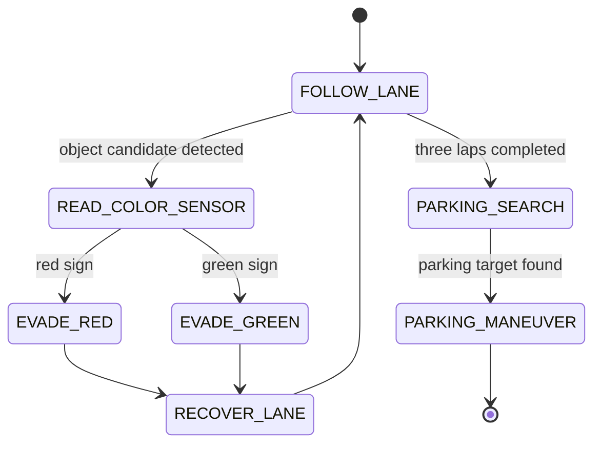

# 7. Obstacle Challenge Strategy

## Current Status

The current hardware list does not include a camera, HuskyLens, PixyCam, RGB color sensor, or other color-recognition device. Because of that, the robot cannot yet identify red and green traffic signs reliably.

This document intentionally records the gap instead of pretending the Obstacle Challenge is solved. The immediate priority is to stabilize the Open Challenge with the Arduino Mega baseline, then choose the missing perception hardware.

## Rule-Based Requirement

The robot must pass red and green traffic signs on the correct side. It must also complete three laps and later perform the parking task. The final strategy needs perception, decision-making, and recovery behavior.

## Current Hardware Assessment

| Available Part | What It Can Do | What It Cannot Do |
| --- | --- | --- |
| Front ultrasonic | Detect a nearby wall or object | Identify object color |
| Right ultrasonic | Estimate wall distance | Classify red or green signs |
| Gyroscope | Estimate rotation during turns | Detect traffic signs or parking markers |
| Arduino Mega | Run state machine and control actuators | Perform camera vision without an added sensor |

## Required Future Decision

The team must choose one of these directions:

| Option | Benefit | Risk |
| --- | --- | --- |
| HuskyLens or similar AI camera | Simple color/object recognition workflow | Needs mounting, lighting tests, and communication code |
| RGB color sensor | Lightweight and simple | May only work at short distance |
| PixyCam or camera module | Stronger visual tracking | More setup complexity |
| Geometry-only obstacle handling | No new sensor | Not reliable for red/green rule compliance |

## Planned State Machine Extension

## Placeholder Interfaces

The Obstacle Challenge firmware will need these interfaces after the sensor is selected:

- `readTrafficSignColor()`
- `handleRedObstacle()`
- `handleGreenObstacle()`
- `recoverAfterObstacle()`
- `searchParkingBox()`
- `performParkingManeuver()`

## Evidence To Collect

- Selected color/vision sensor model.
- Mounting photos.
- Red and green detection samples under practice lighting.
- Detection accuracy table.
- False positive and false negative examples.
- Recovery behavior after each obstacle.
- Communication test between sensor and Arduino Mega.
- Parking marker detection tests.
