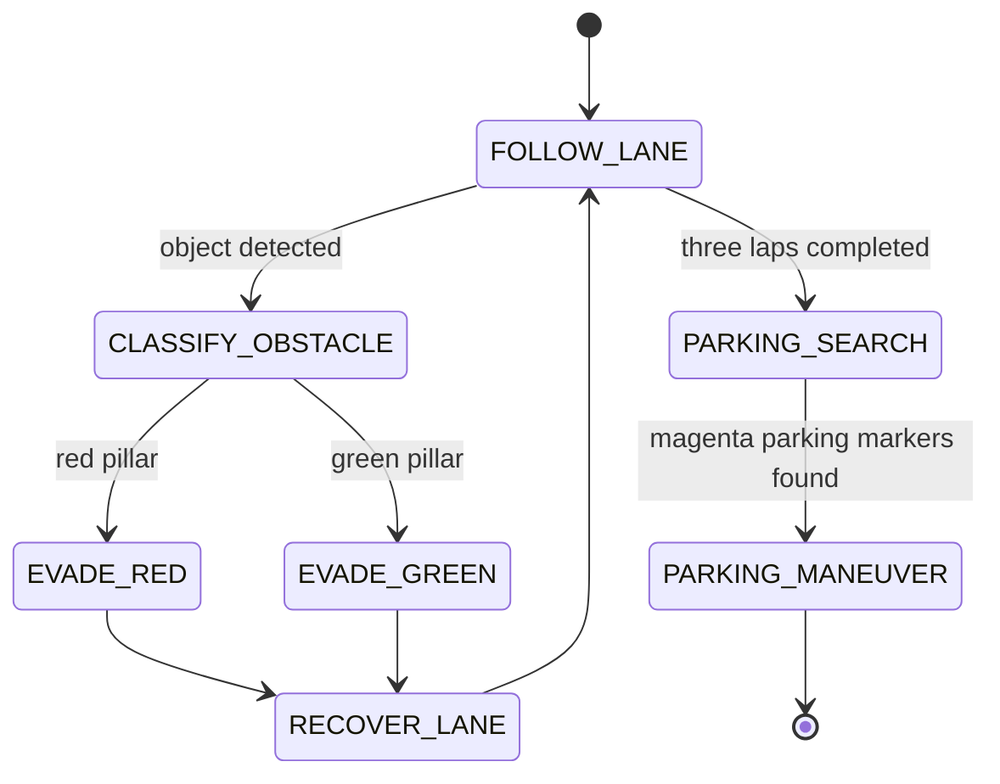

# 7. Obstacle Challenge Strategy

## Current Status

The obstacle strategy is not implemented yet because the current hardware cannot classify red and green pillars. Ultrasonic sensors can detect distance, but they cannot determine color. This is a critical gap for WRO 2026 Obstacle Challenge scoring.

## Rule-Based Requirement

The robot must pass red and green traffic signs on the correct side. It must also complete three laps and later perform the parking task. The final strategy needs perception, decision-making, and recovery behavior.

## Recommended Sensor Options

| Option | Benefit | Risk |
| --- | --- | --- |
| PixyCam 2.1 | Fast color block detection, Arduino friendly | Needs training and mounting |
| Camera plus SBC | Flexible computer vision | More complex power and software |
| RGB color sensors | Cheap and simple | Harder to detect objects at distance |

## Planned State Machine Extension

## Placeholder Interfaces

The Obstacle Challenge firmware contains placeholders for:

- `detectObstacleColor()`
- `handleRedObstacle()`
- `handleGreenObstacle()`
- `searchParkingBox()`
- `performParkingManeuver()`

These functions should be implemented only after the sensor is selected and calibrated.

## Evidence To Collect

- Sensor choice comparison.
- Color samples under competition lighting.
- Detection accuracy table.
- False positive and false negative examples.
- Recovery behavior after each obstacle.
- Parking marker detection tests.

