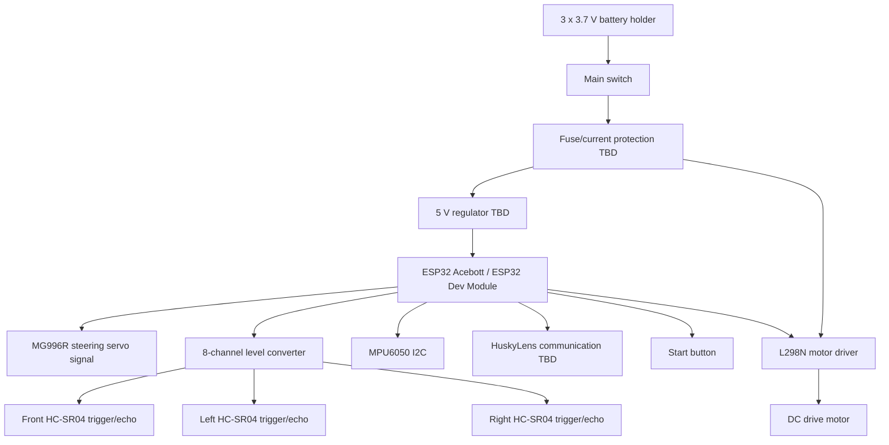

# Electromechanical Overview

This diagram shows the intended relationship between the main electrical and mechanical components.

## Notes

- The L298N will be used for the first DC motor control implementation.
- The MG996R servo may need a separate 5 V supply depending on current draw.
- The ESP32 uses 3.3 V logic, so HC-SR04 echo signals must be protected with the level converter.
- All grounds must be common.
- Final wire colors and connector photos must be documented after the real wiring is cleaned up.

