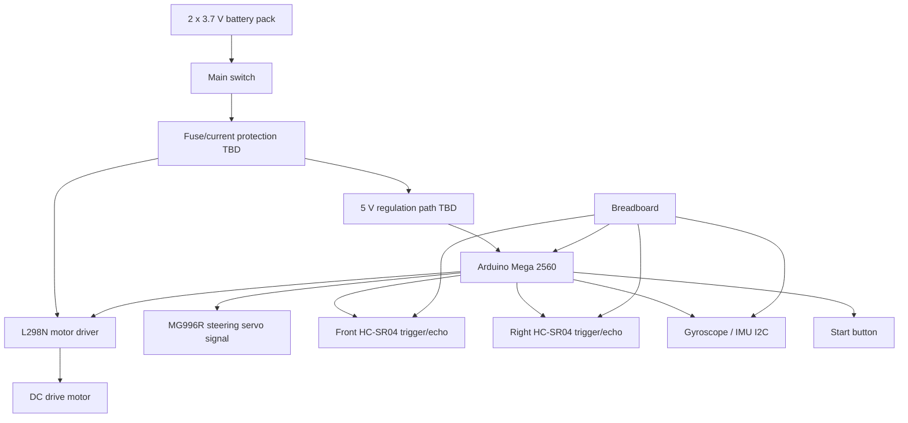

# Electromechanical Overview

This diagram shows the intended relationship between the current electrical and mechanical components.

## Notes

- The L298N will be used for the first DC motor control implementation.
- The MG996R servo may need a separate 5 V supply depending on current draw.
- All grounds must be common.
- The breadboard is a temporary prototyping method; final wiring should be secured before competition.
- Final wire colors and connector photos must be documented after the real wiring is cleaned up.
