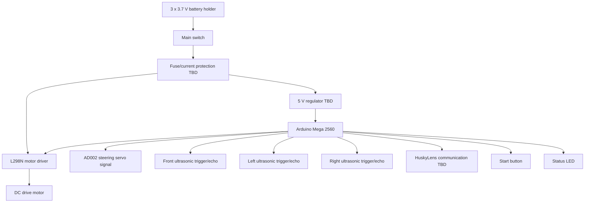

# Electromechanical Overview

This diagram shows the intended relationship between the main electrical and mechanical components.

## Notes

- The L298N will be used for the first DC motor control implementation.
- The servo may need a separate 5 V supply depending on current draw.
- All grounds must be common.
- Final wire colors, pin numbers, and connectors must be documented after the real wiring is built.

